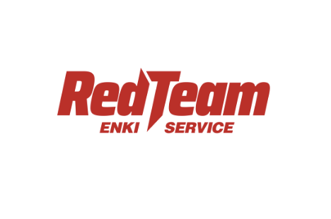
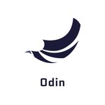

<p align="center">
  <a href="https://github.com/arrester/readme-typing-svg">
    
  </a>
</p>

<p align="center">
  
  
  
</p>

---

## 🎯 About Me

Offensive Security Researcher and Red Team Operator specializing in discovering vulnerabilities in web applications, mobile platforms, and enterprise networks. Since 2022, I have been conducting red team operations and penetration testing for major enterprises, financial institutions, government agencies, and critical infrastructure organizations.

### 🔰 Team Affiliations

<p align="center">
  
  &nbsp;&nbsp;&nbsp;&nbsp;&nbsp;&nbsp;
  
  &nbsp;&nbsp;&nbsp;&nbsp;&nbsp;&nbsp;
  
</p>

<p align="center">
  <strong>ENKI Red Team</strong> | <strong>Odin CTF Team</strong> | <strong>Demon Hacking Team</strong>
</p>

### 🎖️ Focus Areas

```
🌐 Web Application Security              📱 Mobile Security (Android/iOS)
🔐 Internal Pentest(Linux, Windows AD)   📡 Wireless Security
⚔️ Cyber Weapons Research                🔍 Vulnerability Research
```

---

## 💻 Tech Stack

### Languages


---

## 🏆 Professional Experience

<div align="center">

### 🚨 Red Team Operations (2022 - Present)

Conducting advanced red team assessments and penetration testing services for:
- **Major Enterprises** • **Financial Institutions** • **Government Agencies** • **Critical Infrastructure**

</div>

---

## 🎤 Conference Presentations

<details open>
<summary><b>Click to expand/collapse</b></summary>

| Date | Conference | Topic |
|------|------------|-------|
| 2025.11.29 | **BISC 2025** (11th BoB Information Security Conference) | AI Era, What is the Future of Red Teams? |
| 2025.06.17 | **DroidKnights 2025 Conference** | Android App Security from Offensive Red Team Perspective (feat. CVE-2025-****) |
| 2025.05.29 | **16th CPS Security Workshop** | External Attack Surface Management Strategy Based on Red Team Reconnaissance Techniques |
| 2025.02.15 | **30th Hacking Camp** | The Core of Red Team Reconnaissance |
| 2022.10.01 | **PyCon Korea 2022** | That, that I like 'BWASP' |
| 2022.02.01 | **24th Hacking Camp** | Web Vulnerability Manual Analysis Support Tool (BWASP) |
| 2021.07.01 | **2021 CodeEngn Conference 17** | 2020 Android App Vulnerability Analysis and Related Vulnerability Test App Development |
| 2021.02.01 | **22nd Hacking Camp** | Web Vulnerability Scanner |
| ... | *and more* | |

</details>

---

## 🥇 CTF Achievements & Awards

<details open>
<summary><b>Click to expand/collapse</b></summary>

### CTF Competition Results

| Date | Competition | Rank | Team |
|------|-------------|------|------|
| 2025.11.20 | **7th TS Security Bug Finding Competition** | 🥈 Excellence Award | RedOps |
| 2025.10.26 | **SAS CTF 2025 Finals** | 🥉 9th Place | Odin |
| 2025.10.18 | **LINE CTF 2025** | 🥉 3rd Place | Odin |
| 2025.08.31 | **Kaspersky CTF 2025** | 🥇 1st Place | Odin |
| 2025.08.11 | **DEFCON 2025 Red Team Village CTF** | 4th Place | ENKI_WHITEHAT |
| 2024.06.16 | **justCTF 2024 teaser** | 10th Place | Odin |
| 2024.04.21 | **Midnight Sun CTF 2024 Quals** | 11th Place (Finals) | Odin |
| 2024.03.24 | **LINE CTF 2024** | 5th Place | Odin |
| 2024.01.21 | **Insomni'hack teaser** | 9th Place | Odin |
| 2023.10.09 | **BlackHat MEA CTF 2023** | Finals Qualified | White_Hat_Kr |
| ... | *and more* | | |

### Other Awards & Recognition

| Year | Award | Details |
|------|-------|---------|
| 2024 | **Digital Forensics Challenge 2024** | 8th Place (illusion) |
| 2023 | **Digital Forensics Challenge 2023** | 10th Place (illusion) |
| 2020 | **21st Hacking Camp** | Best Hacker Award |
| 2011 | **2nd Busan Robot Competition** | Honorable Mention (Humanoid Battle) |
| ... | *and more* | |

</details>

---

## 🎯 CTF Competition Operations

<details>
<summary><b>Click to expand/collapse</b></summary>

### Competition Operations

| Year | Event | Role |
|------|-------|------|
| 2025 | **FIESTA 2025** | Problem Author & Organizer |
| 2025 | **CCE (Cyber Attack Defense Competition) 2025** | Problem Author & Organizer |
| 2025 | **31st Hacking Camp CTF** | Problem Author & Organizer |
| 2024 | **CCE (Cyber Attack Defense Competition) 2024** | Problem Author & Organizer |
| 2024 | **CODEGATE 2024 International Hacking Defense Competition** | Problem Author & Organizer |
| 2023 | **NSR CCE 2023** | Problem Author & Organizer |
| 2023 | **CODEGATE 2023 International Hacking Defense Competition** | Problem Author & Organizer |
| 2023 | **FIESTA 2023** | Problem Author & Organizer |
| 2022 | **POX CTF 2022** | Problem Author & Organizer |
| ... | *and more* | |

</details>

---

## 🔐 CVE Discoveries

<details open>
<summary><b>Click to expand/collapse</b></summary>

| CVE ID | Category | Target | Vulnerability Type |
|--------|----------|--------|-------------------|
| **KVE-2025-\*\*\*\*** | Web | * | Code Injection (RCE) |
| **KVE-2025-\*\*\*\*** | Web | * | Code Injection (RCE) |
| **CVE-2025-\*\*\*\*** | Web | * | Stored XSS |
| **CVE-2025-\*\*\*\*** | Web | * | Stored XSS |
| **CVE-2025-15138** | Web | TinyFileManager | File Upload (RCE) |
| **CVE-2025-14517** | Mobile | uCrop | Intent Spoofing |
| **CVE-2025-14516** | Mobile | uCrop | SSRF |
| **CVE-2024-37658** | Web | Gnuboard5 | Open Redirect |
| **CVE-2024-37657** | Web | Gnuboard5 | Open Redirect |
| **CVE-2024-37656** | Web | Gnuboard5 | Open Redirect |

</details>

---

## 🛠️ Open Source Security Projects

<div align="center">

### 🔧 Security Tools & Frameworks

</div>

<table>
<tr>
<td width="50%">

#### [BWASP](https://github.com/BWASP/BWASP)
Web vulnerability manual analysis support tool designed to assist security researchers in identifying and analyzing web application vulnerabilities efficiently.

**Tech:** Browser Extension, JavaScript, Python

</td>
<td width="50%">

#### [SubSurfer](https://github.com/arrester/SubSurfer)
Subdomain reconnaissance tool optimized for red teaming and bug bounty operations. Efficiently collects and analyzes subdomain assets.

**Tech:** Python, Async

</td>
</tr>
<tr>
<td width="50%">

#### [EndAbyss](https://github.com/arrester/EndAbyss)
Fast endpoint discovery tool that crawls websites to collect endpoints and parameters for bug bounty and red team operations.

**Tech:** Python, Crawler

</td>
<td width="50%">

#### [FUZZmap](https://github.com/offensive-tooling/FUZZmap)
Web application vulnerability fuzzing tool designed to detect security flaws through automated parameter reconnaissance and advanced payload testing.

**Tech:** Python, Fuzzing, Async

</td>
</tr>
</table>

---

## 🎓 Education & Mentorship

<details>
<summary><b>Click to expand/collapse</b></summary>

<p align="center">
  
  &nbsp;&nbsp;&nbsp;&nbsp;
  
</p>

### BoB WhiteHat School Mentor (2023 - Present)

**2025 (3rd Generation)**
- Project Mentor: "We Found the Bug" - Web Bug Bounty
- Project Mentor: "A dog that was chasing a chicken stares at vulnerability analysis." - Smart Device Vulnerability Analysis
- Training: Mobile App Vulnerability Analysis Basics
- Training: Red Team Practical Understanding
- Training: Information Security Ethics

**2024 (2nd Generation)**
- Project Mentor: "ASAP" - Mobile App Vulnerability Automation Research
- Project Mentor: "Andromeda" - Mobile App Bug Bounty
- Training: Mobile App Vulnerability Analysis Basics
- Training: Red Team Practical Understanding
- Training: Information Security Ethics

**2023 (1st Generation)**
- Project Mentor: "WAD" - AI-based Web Vulnerability Testing Tool Development
- Project Mentor: "BukBuk" - Web Automation Tool Analysis for Bug Bounty Optimization
- Training: Mobile App Vulnerability Analysis Basics
- Training: Information Security Ethics

### BoB (Best of the Best)

**BoB 10th Generation - Vulnerability Analysis Track (2021.07 - 2022.03)**
- **Project:** BWASP (Web Vulnerability Manual Analysis Support Tool) - Project Manager
- Successfully completed the vulnerability analysis track
- Developed browser extension-based web security testing tool

### Selected Training & Lectures

| Date | Organization | Topic |
|------|--------------|-------|
| 2025.09.08-12 | **KISA** | Real-world Scenario Penetration Testing |
| 2025.06.25 | **Seoul Public Institution** | Web Secure Coding |
| 2025.05.28 | **Jeju Public Institution** | Red Team Reconnaissance Methodology & Web Vulnerability Analysis Basics |
| 2024.11.29 | **2024 Cyber Guardians** | Web Hacking (2024.07.01 - 2024.11.29) |
| 2024.07.27 | **BoB WhiteHat School** | Red Team Practical Understanding |
| 2024.07.11-12 | **KISIA Security Academy** | Web Structure for Web Hacking |
| 2024.06.10-12 | **Korea Hydro & Nuclear Power** | CTF Preparation - Beginner to Intermediate Course |
| ... | *and more* | |

</details>

---

## 🎮 Mobile Wargame Platform Operation

<div align="center">

### [mobilehacking.kr](https://mobilehacking.kr/)


**A comprehensive mobile security training platform featuring:**
- 📱 Challenges for Android, iOS, Flutter, React Native platforms
- 🏆 Real-time ranking system
- 🎯 Vulnerability reporting Hall of Fame
- 🔍 Mobile app vulnerability analysis, reverse engineering, penetration testing, and forensics

</div>

---

## 📚 Research Publications

<details>
<summary><b>Click to expand/collapse</b></summary>

| Date | Publication | Title | Role |
|------|-------------|-------|------|
| 2024.02.05 | **Korea Institute of Communication Sciences Winter Conference** | AI-based Web Vulnerability Automated Diagnosis Framework Development | Mentor |
| 2024.02.05 | **Korea Institute of Communication Sciences Winter Conference** | Effective Detection Framework Proposal through XSS Vulnerability Scanning Tool Analysis | Mentor |
| 2021.11.01 | **Korea Institute of Information Security & Cryptology Winter Conference** | Web Vulnerability Analysis Method Using Browser Extension Program | Mentee |

</details>

---

## 📫 Contact & Social

<p align="center">
  <a href="https://github.com/arrester">
    
  </a>
  <a href="mailto:arresterloyal@gmail.com">
    
  </a>
  <a href="https://mobilehacking.kr">
    
  </a>
</p>

<p align="center">
  <i>💡 "Always Learning, Always Breaking, Always Securing"</i>
</p>

---

<p align="center">
  
</p>


